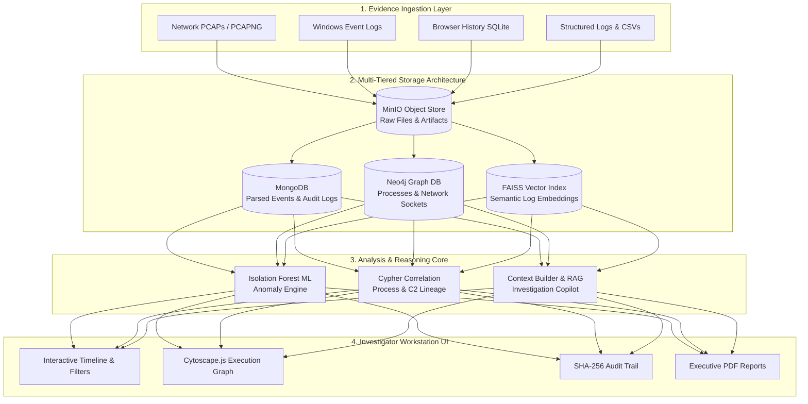

# ForenSight — Digital Forensics & Incident Response Platform

[](https://fastapi.tiangolo.com/)
[](https://react.dev/)
[](https://www.mongodb.com/)
[](https://neo4j.com/)
[](LICENSE)

**ForenSight** is an event-driven digital forensics and incident response (DFIR) platform designed to streamline complex cyber investigations. It ingests raw multi-format evidence (PCAP network captures, Windows EVTX logs, browser SQLite databases, CSVs) and automatically reconstructs attack timelines, maps execution graphs, scores anomalies using machine learning, and produces executive-ready investigation reports.

---

## 📐 System Architecture Diagram



---

## 🔍 Deep-Dive: What ForenSight Does

### 1. 🛡️ Automated Evidence Parsing & Normalization
ForenSight eliminates manual log filtering by extracting structured forensic fields from diverse evidence sources:
- **PCAP / PCAPNG**: Extracts IP packet headers, TCP/UDP socket pairs, payload sizes, DNS queries, and HTTP requests.
- **Windows Event Logs (EVTX)**: Parses process creation (`Event ID 4688`), logon events (`Event IDs 4624 / 4625`), registry modifications, and PowerShell executions.
- **Browser Artifacts (SQLite)**: Extracts URL visit histories, search terms, timestamps, and download records from Chrome/Edge SQLite databases.
- **Normalized Schema**: Standardizes all incoming logs into a unified forensic event schema with timestamps, subjects, actions, and target objects.

---

### 2. 📊 Isolation Forest Machine Learning Anomaly Engine
- **Unsupervised Anomaly Scoring**: Applies an Isolation Forest ML model to evaluate log features (execution frequencies, unusual port usage, off-hour activity, rare command-line flags).
- **Risk Categorization**: Automatically categorizes anomalies by severity (`Critical`, `High`, `Medium`, `Low`).
- **MITRE ATT&CK Mapping**: Correlates detected anomalous behavior to standardized MITRE ATT&CK techniques (e.g., Command and Scripting Interpreter `T1059`, Exploitation of Remote Services `T1210`).

---

### 3. 🕸️ Neo4j Graph Lineage & Execution Reconstruction
- **Entity & Relationship Graphs**: Maps processes, IP addresses, domains, registry keys, and users into a connected graph schema inside Neo4j.
- **Attack Path Discovery**: Reconstructs parent-child process chains (e.g., `cmd.exe` → `powershell.exe` → `vssadmin.exe`) to uncover lateral movement and persistence mechanisms.
- **Cytoscape.js Visualization**: Interactive browser graph viewer with node filtering, expandable relationship edges, and node detail inspectors.

---

### 4. 🧠 Natural Language Investigation Copilot
- **RAG Architecture**: Combines FAISS vector embeddings with graph traversal contexts to answer natural language questions about the evidence.
- **Plain-English Answers**: Converts technical log records into clear forensic explanations for investigators.
- **Prompt Fencing & Security**: Enforces strict XML evidence boundaries to isolate untrusted evidence text from prompt manipulation.

---

### 5. 📑 Executive Reporting & Legal Chain of Custody
- **Executive Summaries**: Compiles key incident milestones, top risk anomalies, and evidence inventories into executive PDF and HTML reports.
- **Cryptographic Audit Log**: Implements an immutable, SHA-256 chained audit trail to log every investigator action, evidence upload, and report generation for strict chain-of-custody compliance.
- **Multi-Tenancy & RBAC**: Tenant isolation across organizations with granular roles (`Admin`, `Investigator`, `Viewer`).

---

## 🏗️ Tech Stack Overview

| Tier | Component | Technology |
| :--- | :--- | :--- |
| **Frontend UI** | Web Interface | React 18, Vite, TailwindCSS, Cytoscape.js |
| **Backend API** | Application Server | Python 3.10+, FastAPI, Uvicorn |
| **Primary Storage** | Event & Case DB | MongoDB |
| **Graph Storage** | Execution Lineage | Neo4j |
| **Vector Engine** | Log Embeddings | FAISS & Qdrant |
| **Object Store** | File Storage | MinIO (S3 Compatible) |
| **Copilot Model** | Natural Language LLM | Groq API |

---

## 🚀 Quick Setup

### 1. Start Database Stack
```bash
docker compose up -d
```

### 2. Start Backend API
```bash
cd backend
python -m uvicorn backend.app.main:app --host 0.0.0.0 --port 8000 --reload
```

### 3. Start Frontend UI
```bash
cd frontend
npm run dev
```

- **App UI**: `http://localhost:5173`
- **API Docs**: `http://localhost:8000/docs`

*(On Windows, you can also double-click `launch.bat` to start all services automatically).*

---

## 📜 License
This project is licensed under the MIT License - see the [LICENSE](LICENSE) file for details.
