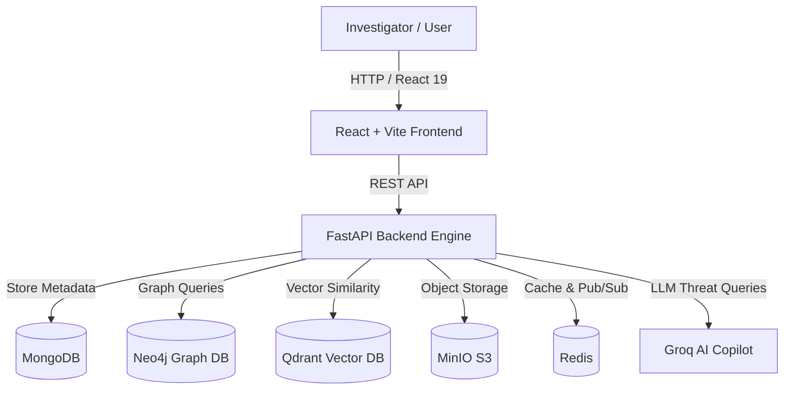

# 🕵️‍♂️ ForenSight — Event-Driven Digital Forensics & AI Copilot Platform

[](https://www.python.org/)
[](https://fastapi.tiangolo.com/)
[](https://reactjs.org/)
[](https://neo4j.com/)
[](https://www.docker.com/)
[](LICENSE)

**ForenSight AI** is an advanced, event-driven Digital Forensics and Incident Response (DFIR) platform equipped with an intelligent AI Copilot, graph visualization engines, automated anomaly detection, and court-ready report generation.

---

## ✨ Key Features

- 📂 **Multi-Format Forensic Ingestion**: Automated ingestion and parsing of Windows Event Logs (`.evtx`), Network Packet Captures (`.pcap`), system memory dumps, and syslog files.
- 🕸️ **Interactive Knowledge Graph**: Maps attack vectors, lateral movements, and entity relationships in real-time using **Neo4j** and **Cytoscape**.
- 🤖 **AI Investigation Copilot**: Natural language query engine backed by **Groq LLMs** and **Qdrant Vector Database** for cross-case similarity search and threat intelligence correlation.
- 🚨 **Machine Learning Anomaly Detection**: Outlier detection models (HBOS via PyOD & Scikit-learn) to highlight suspicious activity across millions of log entries.
- 📄 **Automated PDF Incident Reports**: One-click generation of court-ready forensic audit logs and executive summaries.
- 🛡️ **Multi-Tenant Security & Audit Logging**: Complete RBAC role-based access control, cryptographic evidence hashing, and audit trails.

---

## 🏗️ Architecture & Tech Stack



### 🛠️ Technology Stack
* **Frontend**: React 19, Vite, Cytoscape.js, Lucide Icons, Vanilla CSS
* **Backend**: FastAPI, Uvicorn, Pydantic, Python 3.11+
* **Databases**: MongoDB 6.0, Neo4j 5.12, Qdrant Vector DB, Redis 7.0
* **Storage**: MinIO (S3 compatible evidence vault)
* **Forensic Parsers & ML**: Scapy (`.pcap`), Python-EVTX (`.evtx`), PyOD, Scikit-learn, FAISS, Sentence-Transformers
* **DevOps**: Docker, Docker Compose, PowerShell startup automation

---

## 🚀 Quick Start Guide

### Prerequisites
- [Git](https://git-scm.com/)
- [Node.js](https://nodejs.org/) (v18+)
- [Python](https://www.python.org/) (v3.11+)
- [Docker Desktop](https://www.docker.com/products/docker-desktop/) *(Recommended)*

---

### Option 1: Automatic Startup (Windows PowerShell)

Clone the repository and run the automated startup script:

```powershell
git clone https://github.com/Krishp2007/ForenSight.git
cd ForenSight

powershell -ExecutionPolicy Bypass -File start-all.ps1
```

This will automatically:
1. Spin up Docker containers for **MongoDB**, **Neo4j**, **Redis**, **MinIO**, and **Qdrant**.
2. Install missing frontend npm dependencies.
3. Activate the Python virtual environment and start the **FastAPI Backend**.
4. Launch the **React Frontend** dev server.

---

### Option 2: Manual Setup

#### 1. Infrastructure (Docker)
```bash
docker compose up -d mongodb neo4j redis minio qdrant
```

#### 2. Backend Setup
```bash
cd backend
python -m venv .venv
# On Windows:
.\.venv\Scripts\activate
# On Linux/macOS:
source .venv/bin/activate

pip install -r requirements.txt
python -m uvicorn app.main:app --host 0.0.0.0 --port 8000 --reload
```

#### 3. Frontend Setup
```bash
cd frontend
npm install
npm run dev
```

---

## 🌐 Application Endpoints

| Service | URL | Description |
| :--- | :--- | :--- |
| **Web Dashboard** | `http://localhost:5173` | Main ForenSight AI Investigation App |
| **API Documentation** | `http://localhost:8000/docs` | Interactive Swagger API Explorer |
| **Neo4j Browser** | `http://localhost:7474` | Graph Database UI |
| **MinIO Console** | `http://localhost:9001` | Evidence File Vault (`minioadmin` / `minioadmin`) |

---

## 📁 Project Structure

```text
ForenSight/
├── backend/
│   ├── app/
│   │   ├── api/          # FastAPI routers & endpoints
│   │   ├── db/           # MongoDB, Neo4j, Redis, MinIO drivers
│   │   ├── parsers/      # EVTX, PCAP, System Log parsers
│   │   ├── pipeline/     # Incident processing pipeline
│   │   ├── services/     # AI Copilot, Graph generator, Anomaly detection
│   │   └── main.py       # FastAPI application entry point
│   ├── requirements.txt
│   └── Dockerfile
├── frontend/
│   ├── src/              # React components, stores & styles
│   ├── package.json
│   └── Dockerfile
├── docker-compose.yml     # Multi-container orchestration
├── start-all.ps1         # Automatic launch script for Windows
└── README.md
```

---

## 👥 Project Team

Built as a **2nd Year College Capstone Project** by:

- 💻 **Krish Patel** — [@Krishp2007](https://github.com/Krishp2007)
- 💻 **Shlesh** — [@Shlesh2007](https://github.com/Shlesh2007)

---

## 📜 License

Distributed under the MIT License. See `LICENSE` for more details.
